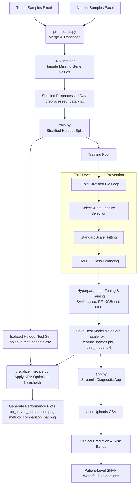

# ML and DL based prediction of bladder cancer
# Decoding Cancer's Autophagy Signature: A Clinical XAI Diagnostic Portal

[](https://www.python.org/)
[](https://scikit-learn.org/)
[](https://xgboost.readthedocs.io/)
[](https://github.com/shap/shap)
[](https://streamlit.io/)
[](https://en.wikipedia.org/wiki/Bioinformatics)

---

### The Autophagy Paradox & Diagnostic Challenge
Autophagy is the cell's internal recycling system. Under normal conditions, cells use it to clean up damaged structures and keep things running smoothly. However, **bladder cancer cells hijack this very mechanism**. In low-nutrient, high-stress tumor environments, cancer cells use autophagy as a shield to survive, multiply, and resist chemotherapy.

Diagnosing these changes early is difficult. Finding the subtle genetic signatures of this cellular hijack among thousands of active genes is like looking for a needle in a haystack. 

This project provides an end-to-end clinical machine learning pipeline and interactive dashboard. It acts as a genomic detective, isolating the top **Autophagy-Related Genes (ARGs)** to predict bladder cancer risk and explain the biological decisions behind those predictions in real-time.

---

## Key Pipeline & Architectural Highlights

This workflow is engineered to solve clinical-grade data challenges with rigorous, industry-standard methodologies:

* **Strict Zero-Leakage Pipeline**: 
  In genomics, small cohorts are easily prone to overfit bias. To prevent this, our pipeline completely isolates a **stratified holdout test set** before any transformations occur. Feature selection, normalization, and class-imbalance oversampling are calculated and applied strictly within training folds, ensuring that validation and test results reflect real patient scenarios.
* **Clinical-First Decision Thresholds**: 
  In oncology, a False Negative (missing a patient's cancer) is dangerous. We adjust model decision thresholds to prioritize **Sensitivity and Negative Predictive Value (NPV)**. This design ensures that patients predicted as "low risk" can be cleared with high confidence, reducing diagnostic error.
* **Addressing Imbalance in Genomic Cohorts**: 
  Faced with an imbalanced dataset (very few normal samples vs. many tumor samples), the pipeline utilizes synthetic class balancing (`SMOTE`) paired with high regularization (such as L1 Lasso coefficients to prune redundant genes, and high weight-decay penalties in Neural Networks) to prevent majority-class bias.
* **Physician-Friendly Interpretability (SHAP)**: 
  Instead of presenting clinicians with a "black box" prediction, the portal integrates SHAP explainability. This generates patient-specific waterfall plots showing how much each gene's expression level pushed the risk prediction toward normal or cancer.

---

## System Pipeline Architecture



---

## Model Evaluation and Holdout Set Performance

Evaluating the trained models on the isolated holdout test set (86 samples: 4 Normal, 82 Tumor) using clinical, NPV-optimized decision thresholds yields the following performance metrics:

| Classifier Model | Decision Threshold | Recall (Sensitivity) | Specificity | NPV | F2-Score | ROC AUC | Confusion Matrix (TN / FP / FN / TP) |
| :--- | :---: | :---: | :---: | :---: | :---: | :---: | :---: |
| **Regularized MLP (DL)** | 0.10 | 1.0000 | 0.5000 | 1.0000 | 0.9951 | 0.9085 | TN=2, FP=2, FN=0, TP=82 |
| **SVM** | 0.15 | 1.0000 | 0.5000 | 1.0000 | 0.9951 | 0.8415 | TN=2, FP=2, FN=0, TP=82 |
| **Logistic Regression** | 0.05 | 1.0000 | 0.5000 | 1.0000 | 0.9951 | 0.8384 | TN=2, FP=2, FN=0, TP=82 |
| **XGBoost** | 0.10 | 0.9878 | 0.7500 | 0.7500 | 0.9878 | 0.9543 | TN=3, FP=1, FN=1, TP=81 |
| **Random Forest** | 0.10 | 0.9756 | 0.7500 | 0.6000 | 0.9780 | 0.8902 | TN=3, FP=1, FN=2, TP=80 |

### Qualitative Highlights

* **Regularized MLP (DL) & SVM**: Offer exceptional sensitivity, leaving no cancer cases undetected (Recall of 1.0000, NPV of 1.0000) while maintaining smooth clinical decision margins.
* **XGBoost**: Delivers robust tree-based classification with the highest overall discriminative performance (ROC AUC of 0.9543) and balanced metrics.
* **Logistic Regression**: Prunes redundant gene features by forcing their coefficients to zero, highlighting the most vital diagnostic signals.
* **Random Forest**: Aggregates predictions across a forest of decision trees to minimize model variance.

---

## Streamlit Portal Features

The interactive web portal brings the pipeline to life for clinicians:

1. **Batch Patient Upload**: Drag-and-drop a CSV file containing patient gene expression values.
2. **Interactive Patient Analysis**: Select any patient from a dropdown to trigger a local SHAP explanation.
3. **Genomic Driver Summaries**: View customized oncology literature descriptions explaining the biological roles of top contributing genes (e.g. `SYNPO2` cytoskeletal regulation, `FOS` proto-oncogene activation, `DCN` tumor suppression).
4. **Cohort Global Insights**: Toggle interactive global plots to see which genes are the overall drivers of cancer risk across the entire cohort.

---

## Installation & Setup

1. **Verify Raw Data Files**
   Ensure the following raw data files are in your working directory:
   * `Tumor_samples_408_filtered_quantile_0.25_last_step (1).xlsx`
   * `Normal_samples_19_filtered_quantile_0.25_last_step (2).xlsx`

2. **Install Required Packages**
   Install the required dependencies from the project root:
   ```bash
   pip install -r requirements.txt
   ```

---

## Step-by-Step Running Guide

### Step 1: Preprocess the Genomic Matrices
Align datasets, transpose patients to rows, and impute missing genes.
```bash
python preprocess.py
```
*Generated output:* `preprocessed_data.xlsx`

### Step 2: Run the Training & CV Pipeline
Execute nested cross-validation, feature selection, scaling, class balancing, and model training.
```bash
python train.py
```
*Generated outputs:* `feature_names.pkl`, `scaler.pkl`, `best_model.pkl`, `XGBoost_best_model.pkl`, `model_metadata.json`, `holdout_test_patients.csv`, and `holdout_test_labels.csv`.

### Step 3: Compare Models & Save Comparison Charts
Evaluate models on the holdout test set under optimized decision thresholds and output performance charts.
```bash
python visualize_metrics.py
```
*Generated outputs:* `roc_curves_comparison.png` and `metrics_comparison_bar.png`

### Step 4: Launch the Streamlit Interactive Portal
```bash
streamlit run app.py
```
Upload the generated `holdout_test_patients.csv` (or any patient gene expression profile CSV) to test predictions and review patient SHAP waterfalls.

---

## Codebase Navigation

* **[preprocess.py](file:///c:/Users/hp/OneDrive/Desktop/projects/preprocess.py)**: Imports, transposes, labels, and imputes raw genomic worksheets.
* **[train.py](file:///c:/Users/hp/OneDrive/Desktop/projects/train.py)**: Performs hyperparameter tuning and trains regularized machine learning and neural network models.
* **[visualize_metrics.py](file:///c:/Users/hp/OneDrive/Desktop/projects/visualize_metrics.py)**: Evaluates predictions under optimized clinical decision thresholds and exports plots.
* **[compare_all_models.py](file:///c:/Users/hp/OneDrive/Desktop/projects/compare_all_models.py)**: Runs validation checks across standard classification baselines.
* **[app.py](file:///c:/Users/hp/OneDrive/Desktop/projects/app.py)**: Streamlit app code displaying predictions, patient risk profiles, and local SHAP waterfall plots.
* **[test_dl.py](file:///c:/Users/hp/OneDrive/Desktop/projects/test_dl.py)**: Utility to verify best-performing MLP diagnostic metrics.

[](https://www.python.org/)
[](https://scikit-learn.org/)
[](https://xgboost.readthedocs.io/)
[](https://github.com/shap/shap)
[](https://streamlit.io/)
[](https://en.wikipedia.org/wiki/Bioinformatics)

---

### The Autophagy Paradox & Diagnostic Challenge
Autophagy is the cell's internal recycling system. Under normal conditions, cells use it to clean up damaged structures and keep things running smoothly. However, **bladder cancer cells hijack this very mechanism**. In low-nutrient, high-stress tumor environments, cancer cells use autophagy as a shield to survive, multiply, and resist chemotherapy.

Diagnosing these changes early is difficult. Finding the subtle genetic signatures of this cellular hijack among thousands of active genes is like looking for a needle in a haystack. 

This project provides an end-to-end clinical machine learning pipeline and interactive **Explainable AI (XAI)** dashboard. It acts as a genomic detective, isolating the top **Autophagy-Related Genes (ARGs)** to predict bladder cancer risk and explain the biological decisions behind those predictions in real-time.

---

## Key Pipeline & Architectural Highlights

This workflow is engineered to solve clinical-grade data challenges with rigorous, industry-standard methodologies:

* **Strict Zero-Leakage Pipeline**: 
  In genomics, small cohorts are easily prone to overfit bias. To prevent this, our pipeline completely isolates a **stratified holdout test set** before any transformations occur. Feature selection, normalization, and class-imbalance oversampling are calculated and applied strictly within training folds, ensuring that validation and test results reflect real patient scenarios.
* **Clinical-First Decision Thresholds**: 
  In oncology, a False Negative (missing a patient's cancer) is dangerous. We adjust model decision thresholds to prioritize **Sensitivity and Negative Predictive Value (NPV)**. This design ensures that patients predicted as "low risk" can be cleared with high confidence, reducing diagnostic error.
* **Addressing Imbalance in Genomic Cohorts**: 
  Faced with an imbalanced dataset (very few normal samples vs. many tumor samples), the pipeline utilizes synthetic class balancing (`SMOTE`) paired with high regularization (such as L1 Lasso coefficients to prune redundant genes, and high weight-decay penalties in Neural Networks) to prevent majority-class bias.
* **Physician-Friendly Interpretability (SHAP)**: 
  Instead of presenting clinicians with a "black box" prediction, the portal integrates SHAP explainability. This generates patient-specific waterfall plots showing how much each gene's expression level pushed the risk prediction toward normal or cancer.

---

## System Pipeline Architecture


---

## Model Evaluation and Holdout Set Performance

Evaluating the trained models on the isolated holdout test set (86 samples: 4 Normal, 82 Tumor) using clinical, NPV-optimized decision thresholds yields the following performance metrics:

| Classifier Model | Decision Threshold | Recall (Sensitivity) | Specificity | NPV | F2-Score | ROC AUC | Confusion Matrix (TN / FP / FN / TP) |
| :--- | :---: | :---: | :---: | :---: | :---: | :---: | :---: |
| **Regularized MLP (DL)** | 0.10 | 1.0000 | 0.5000 | 1.0000 | 0.9951 | 0.9085 | TN=2, FP=2, FN=0, TP=82 |
| **SVM** | 0.15 | 1.0000 | 0.5000 | 1.0000 | 0.9951 | 0.8415 | TN=2, FP=2, FN=0, TP=82 |
| **Logistic Regression** | 0.05 | 1.0000 | 0.5000 | 1.0000 | 0.9951 | 0.8384 | TN=2, FP=2, FN=0, TP=82 |
| **XGBoost** | 0.10 | 0.9878 | 0.7500 | 0.7500 | 0.9878 | 0.9543 | TN=3, FP=1, FN=1, TP=81 |
| **Random Forest** | 0.10 | 0.9756 | 0.7500 | 0.6000 | 0.9780 | 0.8902 | TN=3, FP=1, FN=2, TP=80 |

### Qualitative Highlights

* **Regularized MLP (DL) & SVM**: Offer exceptional sensitivity, leaving no cancer cases undetected (Recall of 1.0000, NPV of 1.0000) while maintaining smooth clinical decision margins.
* **XGBoost**: Delivers robust tree-based classification with the highest overall discriminative performance (ROC AUC of 0.9543) and balanced metrics.
* **Logistic Regression**: Prunes redundant gene features by forcing their coefficients to zero, highlighting the most vital diagnostic signals.
* **Random Forest**: Aggregates predictions across a forest of decision trees to minimize model variance.

---

## Streamlit Portal Features

The interactive web portal brings the pipeline to life for clinicians:

1. **Batch Patient Upload**: Drag-and-drop a CSV file containing patient gene expression values.
2. **Interactive Patient Analysis**: Select any patient from a dropdown to trigger a local SHAP explanation.
3. **Genomic Driver Summaries**: View customized oncology literature descriptions explaining the biological roles of top contributing genes (e.g. `SYNPO2` cytoskeletal regulation, `FOS` proto-oncogene activation, `DCN` tumor suppression).
4. **Cohort Global Insights**: Toggle interactive global plots to see which genes are the overall drivers of cancer risk across the entire cohort.

---

## Installation & Setup

1. **Verify Raw Data Files**
   Ensure the following raw data files are in your working directory:
   * `Tumor_samples_408_filtered_quantile_0.25_last_step (1).xlsx`
   * `Normal_samples_19_filtered_quantile_0.25_last_step (2).xlsx`

2. **Install Required Packages**
   Install the required dependencies from the project root:
   ```bash
   pip install -r requirements.txt
   ```

---

## Step-by-Step Running Guide

### Step 1: Preprocess the Genomic Matrices
Align datasets, transpose patients to rows, and impute missing genes.
```bash
python preprocess.py
```
*Generated output:* `preprocessed_data.xlsx`

### Step 2: Run the Training & CV Pipeline
Execute nested cross-validation, feature selection, scaling, class balancing, and model training.
```bash
python train.py
```
*Generated outputs:* `feature_names.pkl`, `scaler.pkl`, `best_model.pkl`, `XGBoost_best_model.pkl`, `model_metadata.json`, `holdout_test_patients.csv`, and `holdout_test_labels.csv`.

### Step 3: Compare Models & Save Comparison Charts
Evaluate models on the holdout test set under optimized decision thresholds and output performance charts.
```bash
python visualize_metrics.py
```
*Generated outputs:* `roc_curves_comparison.png` and `metrics_comparison_bar.png`

### Step 4: Launch the Streamlit Interactive Portal
```bash
streamlit run app.py
```
Upload the generated `holdout_test_patients.csv` (or any patient gene expression profile CSV) to test predictions and review patient SHAP waterfalls.

---


